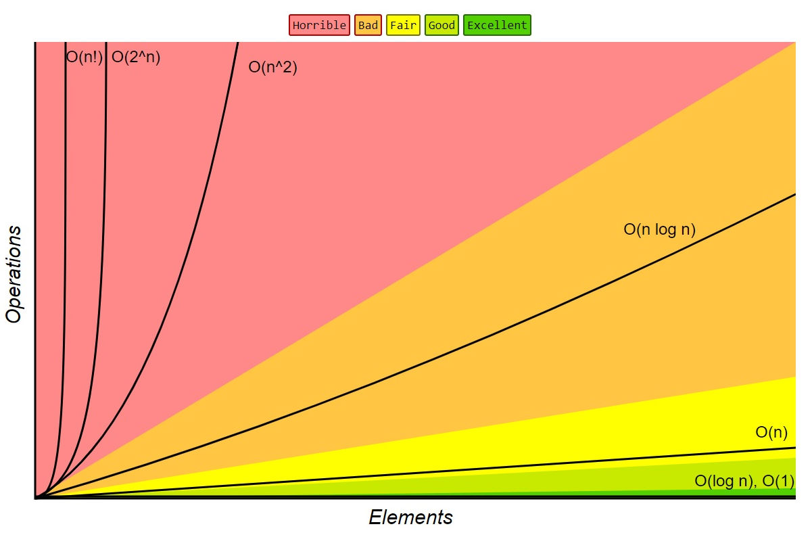

# Data Structures & Algorithms in Zig

## Basics

### Big-O Time Complexity

Big-O time complexity is a generalised way of assessing how an algorithm functions in terms of time and memory required and catagorising it based on this.

```zig
fn sumCharCodes(n: []const u8) usize {
    var sum: usize = 0;
    for (n) |char| sum += char;
    return sum;
}
```

Here we have a simple function that takes in a string (`[]const u8` in Zig) called `n`, we loop over and sum the Unicode values of each character, and return the sum of the character codes.

The easiest way to assess what the Big-O complexity is, is to look for loops.

Here we have a single loop which goes through each character of the input string, so our Big-O complexity is entirely dependant on the length of the input string. The longer the string the more loops have to run to complete the task.

Meaning this function is **O(N), or linear** - the longer the string the longer the time and greater the memory needed to loop over it.

So here we can generally say that a string of 100 characters would take about 10x the time and memory of a string of 10 characters, because the complexity scales in a linear fashion.

It is worth noting that the steps of initialising `var sum` and returning with `return sum` are disregarded as these are **constants**, they never change and always occur no matter the size of the input.

```zig
fn sumCharCodesE(n: []const u8) usize {
    var sum: usize = 0;
    for (n) |char| {
        if (char == 69) return sum; // return if 'E' is encountered
        sum += char;
    }
    return sum;
}
```

In the above code example we return early if the current character is 'E'. Despit this the function still conforms to O(N) time complexity. This is because when we're assessing the Big-O time complexity we conform to the **worst case scenario**, here the worst case scenario is that we never encounter 'E'.

This gives us three basic rules to follow when calculating Big-O time complexity:

1. Growth is with respect to our input.
2. Constants are disregarded.
3. We alway measure based on the worst case scenario.

Some common Big-O complexity:

- O(1) execution time is always the same, no matter the size of the input.
- O(logN) execution time is increase donly marginally by the input.
- O(N) execution time grows linearly with the input.
- O(NlogN) execution time begins to grow exponentially.
- O(N^2) execution time grows rapidly in an exponential manner.
- O(2^N) grows so quickly it is typically not possible to run on traditional hardware.
- O(N!) grows so quickly it is typically not possible to run on traditional hardware.



```zig
fn sumCharCodesS(n: []const u8) usize {
    var sum: usize = 0;
    for (n) |_| {
        for (n) |char| {
            sum += char;
        }
    }
    return sum;
}
```

He we have an example of O(N^2), here we see that we have a for loop within a for loop. So for every individual loop of the outer loop, the inner loop must run until it is complete.

We could think of this like drawing a square, drawing out all the columns of an individual row before starting to draw the next row.

Each row confirms to O(N) but as with have draw every column within that row we square our time complexity, and therefore it is O(N^2).

Likewise, if we were to introduce a third dimention and work with a matrix our complexity would be O(N^3).

Quicksort conforms to O(NlogN).

Binary tree search conforms to O(logN).

Constant Time Operations:

When working with an array, accessing (reading/writing/deleting) any given element is an O(1) constant time operation because the length of the array is known and cannot change, so accessing any element will take the same amount of time, if we needed to iterate through every element that would be an O(N) where N is affected by the length of an array, but the increase in time would grow linearly.

## Search

### Linear Search

A simple linear search will check all the elements of an array and return true if it matches an input to search for, if it cannot find a match based on the input we return false, in the following example our array is the `haystack` and the input we are searching for is the `needle`:

```zig
pub fn linearSearch(haystack: []isize, needle: isize) bool {
    for (haystack) |e| if (e == needle) return true;
    return false;
}
```

This example is O(N) complexity, as the complexity increases with the size of the input. A larger array to search through would linearly increase the time and memory complexity of the search.

### Binary Search

Binary search needs the input to be ordered before searching begins. This is because, unlike a linear search, we do not check every element of the input, but rather we disregard half of the input based whether the value we're searching for is less than or greater than the value at the middle of the input each time it is halved.

This means our complexity is O(logN), comparing this to O(N) of a linear search, if we had 4096 values, a binary search would complete in a maximum of 12 loops, a linear search would complete in a maximum of 4096 loops.

NOTE: If our input is halved at every loop we're likely dealing with O(logN) or O(NlogN)!

Here is the pseudocode for a recursive version of the binary search:

```pseudocode
binarySearch(haystack, needle)
  low = 0
  high = haystack.length

  while (low < high)
    middle = low + (high - low) / 2
    value = haystack[middle]

    if value == needle
      return true
    else if value > needle
      high = middle
    else
      low = middle + 1

  return false
```

### The Two Crystal Ball Problem

> Given two crystal balls that will break if dropped from a high enough distance, determine the exact spot in which it will break in the most optimised way.

If we think of this in terms of a 100 storey building, what we're trying to establish is the lowest floor at which a crystal ball will break.

In DSA terms, we're looking at an array:

`0 [ f, f . . . f, t, . . . ] n`

At some point in the array, the value that represents a crystal ball breaking will switch from false to true. We are trying to find that point in the most efficient way possible.

If we were to check floor by floor (or array element by array element) when the crystal ball would break we would have a time complexity of O(N), BUT we have TWO crystal balls.

An effective approach that is more efficient than a O(N) approach would be to jump through the values in chunks, and once we get our first "break" we can got to the start of the previous chunk and begin check linearly from there.

A convenient way to do this would be to calculate the square root of N and jump through it that way. While this is not recognised as a standard Big-O notation, it would confirm to O(sqrtN).

This is beacuse at most we jump though the array in blocks of sqrt of N, jump back once a sqrt of N and then check a single block of sqrt of N in a linear fashion.

```zig
// take in a type (T) and an array of type T (breaks)
// we will return an optional usize, either the index we start breaking at
// or null to indicate no breaks were found
pub fn two_crystal_balls(comptime T: type, breaks: T) ?usize {
    // calculate our jumps
    const jump: usize = std.math.floor(std.math.sqrt(breaks.len));

    var i: usize = jump; // set the index to the first jump point

    // loop over the arrays in jumps
    while (i < breaks.length) : (i += jump) {
        if (breaks[i]) break; // break out once we find a break (ball 1 gone)
    }

    i -= jump; // go back one jump

    // loop over the array one element at a time
    while (i < breaks.length) : (i += 1) {
        if (breaks[i]) return i; // return the index of the first break (ball 2 gone)
    }

    return null; // return null if no breaks are found
}
```

## Sort

### Bubble Sort

In mathematical terms we would describe an array as sorted if all the elements conform to:

`0 [ 1, 2, 3 . . . 8, 9, 10 ] n`
`Xi <= Xi+1`

The value in any given 'i' position (an element) within an array 'X' must be less than or equal to the value in the next position 'i+1'.

A bubble sort starts at the 0th position and progresses to the end of the array.

```
0 [ 1, 3, 7, 4, 2 ] n
    ^
```

If at any point it encounters a value that is not greater than or equal to itself in the next position, the values are swapped.

```
0 [ 1, 3, 4, 2, 7 ] n
             ^
```

In our example array, once we have reached the second to last position and swapped any values that didn't conform to `Xi <= Xi+1` we have a **more** sorted array, but not a fully sorted array. Once thing we can guarantee is that the largest itemn in our array will be at the end of the array after one iteration, so we can then disregard the last element, and for each iteration we can disregard one less element.

```
0 [ 1, 3, 4, 2 | 7 ] n
    ^
```

We sort again but ignore the last element:

```
0 [ 1, 3, 2, 4 | 7 ] n
          ^
```

And we start the next iteration ignoring the last 2 elements, and so on until the array is fully sorted...

I terms of time complexity, as we progress through our sort we start by going through all elements, N elements, and for each subsequent iteration we go through N-1, N-2, N-3, N-... and so on, until we get to N - N + 1, the final element.

This functions similarly to having a loop within a loop, in that for each individual elemen, we must run through the length of the array to perform the sort. Meaning this algorithm conforms to O(N^2).

## Linked List Data Structures

### Linked List Data Structure

Linked lists are made up of two things, the list and its nodes. Nodes are what store data and can have a pointer to the next and previous nodes (the last node in the list will point to `null` as it's next node, and the first node will point to `null` as it's previous node).

The list simply defines the data type of the nodes and entry points into the nodes with a `head` and `tail` which points to the first and last nodes. It can also contain additional data such as the length.

A list will look like this:
`(HEAD) ->/null <- [0] <-> [1] <-> [2] <-> [3] -> null/<- (TAIL)`

The nodes that make up the list will be of type `List(T).Node` and contain a value, and a pointer to the next and previous nodes.

```
Node
  data: T
  next: ?Node
  prev: ?Node
```

### Linked List Complexity

**Insertion and deletion** into a linked list can be a very cheap operation as the nodes are individually alloctaed items in memory, and are not part of a contiguous data structure like an array, where insertion would require copying the existing data with the addition of the inserted data.

Instead an individual node can be inserted or deletion, by updating the next and prev pointers of the neigbouring nodes and setting the next/prev pointers of the new node. These operations will only ever require changing or setting these 4 values, and so the time complexity is O(1) - constant time.

If we **insert or delete a node part way into list** this incurs a O(N) operation as we need to walk to the position with a for loop before we can perform the indert or delete operation.

**Getting the head or tail values** is O(1) as we can get these directly from the list, but if we need any other node we need to walk the list, which is based on how many nodes we need to transverse, so is therefore O(N).

So, to summarise:
Operations at the start (head) or end (tail) are very cheap: O(1).
Operations within the list require tranversal to the node we are working with: O(N), but the operation itself is O(1).

### Queue

A queue is a specific implementation of a linked list which operates in a FIFO patters, the values we add to the list are first in, first out. We **enqueue** a value to the end of the list (append) and we **dequeue** a value from the start of the list (return the value of the node and then delete it).

So if we had:

`HEAD-> [A] <-> [B] <-> [C] <-TAIL`

We would `enqueue(D)`:

`HEAD-> [A] <-> [B] <-> [C] <-> [D] <-TAIL`

And we would get and remove `A` with `dequeue()`:

`HEAD-> [B] <-> [C] <-> [D] <-TAIL`

Queues also have a `peek()` operation so you can get the value of the next item in the queue without removing it from the list.

A good example of a queue would be a playlist, we enqueue tracks we want to listen to at the bottom of the playlist and we dequeue the next track that is played from the top of the playlist.

All queue operations are O(1) as we only work with value at the start or end of the list.

### Stack

A stack is a another implementation of a linked list which operates in a FILO patters, the values we add to the list are first in, last out. We **push** a value to the end of the list (append) and we **pop** a value from the end of the list (return the value of the node and then delete it).

So if we had:

`HEAD-> [A] <-> [B] <-> [C] <-TAIL`

We would `push(D)`:

`HEAD-> [A] <-> [B] <-> [C] <-> [D] <-TAIL`

And we would get and remove `D` with `pop()`:

`HEAD-> [A] <-> [B] <-> [C] <-TAIL`

Subsequent `pop()`s would return and remove `C`, `B` and then `A`.

A good example of a stack would be a program calling functions recursively, the last function called will be the first to return.

All queue operations are O(1) as we only work with value at the end of the list.

## Arrays

### Arrays vs Linked Lists

Arrays offer access by index, making reading and writing operations O(1) at any point in the array. In a linked list this is only true of the head or tail values, any other point in the list requires walking through the list until the value is arrived at.

This also means the only way of searching a linked list is by using a linear search, as a list cannot be split like in a binary search.

However, because an array must exist in a contiguous chunk of memory, inserts and deletion require moving and shifting of array data which is much slower O(N) than deleting and insertion in a list O(1).

### ArrayList

An array has a length (len), which when is full we cannot expand - we need to copy the contents to a new array with a larger length.

An ArrayList has a length (len) and a capacity (cap), typically the capacity is kept larger than the length in order to allow the ArrayList to grow dynamically. This is done my copying the data of the ArrayList to another chunk of memory with a larger capacity, but unlike moving between arrays for more capacity, ArrayLists handle this dynamically and largely automatically, and they can employ strategies to ensure capacity is available at all times.

This means ArrayLists can use regular array operations (writing data directly to an index) or use stack operations (pushing/popping). For queue operations an ArrayBuffer/Ring Buffer is the better option.

### ArrayBuffers: Ring Buffers

ArrayBuffers or Ring Buffers are similar to an ArrayList but have capacity ahead of index 0 as well as beyond the length. ArrayBuffers also loop around, meaning it it possible for the head to be at the end of the array and the tail be at the start of the array.

Calculating the position of the head and tail can be done easily by `tail % len`or `head % len`.

The tail cannot exceed the head, as this is what defines the buffer. Resizing the ArrayBuffer means copying all contents over to a new, larger array.

## Recursion

A recursive function is a function that calls itself until it reaches a "base case", at which point it won't recurse any further and will return to the top of the call stack.

A simple example:

```zig
const std = @import("std");

pub fn main() !void {
    _ = foo(10); // dispose the return
}

fn foo(n: usize) usize {
    // base case
    if (n == 1) {
        std.debug.print("base case! {}\n", .{n});
        return n;
    }

    // recurse case
    std.debug.print("recurse case! {}\n", .{n});
    return foo(n - 1);
}
```

This will print:

```
recurse case! 10
recurse case! 9
recurse case! 8
recurse case! 7
recurse case! 6
recurse case! 5
recurse case! 4
recurse case! 3
recurse case! 2
base case! 1
```

What is happening is that everytime we don't meet the base case, we print out `recurse case! n` (where `n` is the current number), and then the function will call itself passing `n - 1`. This will continue until `n` is 1, at which point we print out `base case! 1` and return to calling stack (the `main` function).

We must *always* have a base case, otherwise our recursive functions would recurse forever (or until we ran out fo memory)!

Our recurse case can be broken down into three steps:

1. Pre - what we do before we recurse, in this example we print output.
2. Recurse - the recurse step itself.
3. Post - we can recurse to a variable, and perform additional steps before returning it.

```zig
// pre
std.debug.print("recurse case! {}\n", .{n});

// recurse
const value = foo(n - 1);

// post
std.debug.print("recurse complete!\n", .{});

// return recurse value
return value;
```

No matter how many times the function recurses, the pre will *always* happen before the recurse, and the post will always happen after.

So if we recursed three times, that would look like this:

`PRE/RECURSE 1 -> PRE/RECURSE 2 -> PRE/RECURSE 3 -> POST/RETURN 3 -> POST/RETURN 2 -> POST/RETURN 1`

Understanding this is key to trees and graphs.

### Maze Solver

We will start with an array of stings:

```
.{
    .{ '#', '#', '#', '#', '#' },
    .{ '#', ' ', ' ', ' ', 'E' },
    .{ '#', '#', ' ', '#', '#' },
    .{ '#', ' ', ' ', ' ', '#' },
    .{ '#', 'S', '#', '#', '#' },
}
```

- \# is a wall that cannot be passed through
- S is the start
- E is the end
- we cannot leave the bounds of the array
- any other points (spaces in this example) can be walked

How do we walk from S to E?

We can transverse the maze with a recursive function.

First we must establish our base case, assuming from S we can travel up, right, down or left UNLESS we encounter a barrier - we cannot travel through a wall (\#) and we cannot travel ouside the bounds of the array.

Base case:

1. is it a wall? Return false.
2. is it outside the array? Return false.
3. is the then end (E)? Return true.
4. have we seen the space? Return false.

Recurse case:

1. Pre: Set our current position as seen and add our current position to our path.
2. Recurse: For all four possible direction we can walk the maze, we recursively call our function and return true if it returns true.
3. Post: If we reach post, we remove the current position from our path and return false.

By recursevely running this function we will eventually end up with a list of moves that gives us our shortest path, from S to E.

Always try to establish a well defined base case before moving on to recursion, it will massively reduce complexity and make the recurse case much simpler.

There is a lot of crossover between recusion and looping, but there are cases where recursion is the better or only option. The maze solver is one such case where the complexity of implementing a solution as a loop would be impracticle, and recusion is the only option.

The time complexity of a recursive function is O(N).

## Quick Sort

## Doubly Linked List

## Trees

## Tree Search

## Heap

## Graphs

## Maps & LRU
