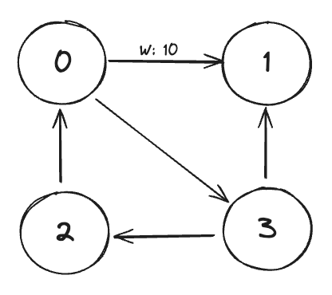
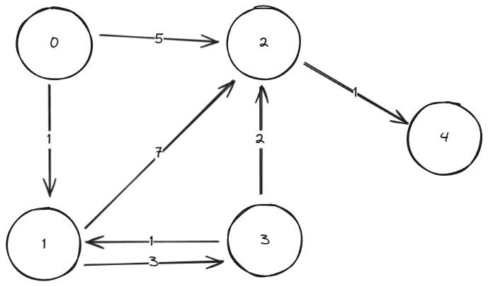
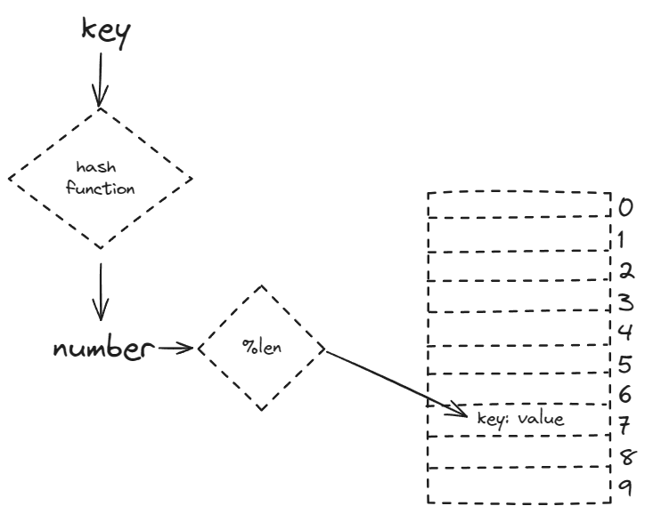

# Data Structures & Algorithms in Zig

## Basics

### Big-O Time Complexity

Big-O time complexity is a generalised way of assessing how an algorithm functions in terms of time and memory required and catagorising it based on this.

```zig
fn sumCharCodes(n: []const u8) usize {
    var sum: usize = 0;
    for (n) |char| sum += char;
    return sum;
}
```

Here we have a simple function that takes in a string (`[]const u8` in Zig) called `n`, we loop over and sum the Unicode values of each character, and return the sum of the character codes.

The easiest way to assess what the Big-O complexity is, is to look for loops.

Here we have a single loop which goes through each character of the input string, so our Big-O complexity is entirely dependent on the length of the input string. The longer the string the more loops have to run to complete the task.

Meaning this function is **O(N), or linear** - the longer the string the longer the time and greater the memory needed to loop over it.

So here we can generally say that a string of 100 characters would take about 10x the time and memory of a string of 10 characters, because the complexity scales in a linear fashion.

It is worth noting that the steps of initialising `var sum` and returning with `return sum` are disregarded as these are **constants**, they never change and always occur no matter the size of the input.

```zig
fn sumCharCodesE(n: []const u8) usize {
    var sum: usize = 0;
    for (n) |char| {
        if (char == 69) return sum; // return if 'E' is encountered
        sum += char;
    }
    return sum;
}
```

In the above code example we return early if the current character is 'E'. Despite this the function still conforms to O(N) time complexity. This is because when we're assessing the Big-O time complexity we conform to the **worst case scenario**, here the worst case scenario is that we never encounter 'E'.

This gives us three basic rules to follow when calculating Big-O time complexity:

1. Growth is with respect to our input.
2. Constants are disregarded.
3. We alway measure based on the worst case scenario.

Some common Big-O complexity:

- O(1) execution time is always the same, no matter the size of the input.
- O(logN) execution time is increased only marginally by the input.
- O(N) execution time grows linearly with the input.
- O(NlogN) execution time begins to grow exponentially.
- O(N^2) execution time grows rapidly in an exponential manner.
- O(2^N) grows so quickly it is typically not possible to run on traditional hardware.
- O(N!) grows so quickly it is typically not possible to run on traditional hardware.


```zig
fn sumCharCodesS(n: []const u8) usize {
    var sum: usize = 0;
    for (n) |_| {
        for (n) |char| {
            sum += char;
        }
    }
    return sum;
}
```

He we have an example of O(N^2), here we see that we have a for loop within a for loop. So for every individual loop of the outer loop, the inner loop must run until it is complete.

We could think of this like drawing a square, drawing out all the columns of an individual row before starting to draw the next row.

Each row confirms to O(N) but as with have draw every column within that row we square our time complexity, and therefore it is O(N^2).

Likewise, if we were to introduce a third dimension and work with a matrix our complexity would be O(N^3).

Quick sort conforms to O(NlogN).

Binary tree search conforms to O(logN).

Constant Time Operations:

When working with an array, accessing (reading/writing/deleting) any given element is an O(1) constant time operation because the length of the array is known and cannot change, so accessing any element will take the same amount of time, if we needed to iterate through every element that would be an O(N) where N is affected by the length of an array, but the increase in time would grow linearly.

## Search

### Linear Search

A simple linear search will check all the elements of an array and return true if it matches an input to search for, if it cannot find a match based on the input we return false, in the following example our array is the `haystack` and the input we are searching for is the `needle`:

```zig
pub fn linearSearch(haystack: []isize, needle: isize) bool {
    for (haystack) |e| if (e == needle) return true;
    return false;
}
```

This example is O(N) complexity, as the complexity increases with the size of the input. A larger array to search through would linearly increase the time and memory complexity of the search.

### Binary Search

Binary search needs the input to be ordered before searching begins. This is because, unlike a linear search, we do not check every element of the input, but rather we disregard half of the input based whether the value we're searching for is less than or greater than the value at the middle of the input each time it is halved.

This means our complexity is O(logN), comparing this to O(N) of a linear search, if we had 4096 values, a binary search would complete in a maximum of 12 loops, a linear search would complete in a maximum of 4096 loops.

> NOTE: If our input is halved at every loop we're likely dealing with O(logN) or O(NlogN)!

Here is the pseudocode for a recursive version of the binary search:

```pseudocode
binarySearch(haystack, needle)
  low = 0
  high = haystack.length

  while (low < high)
    middle = low + (high - low) / 2
    value = haystack[middle]

    if value == needle
      return true
    else if value > needle
      high = middle
    else
      low = middle + 1

  return false
```

### The Two Crystal Ball Problem

> Given two crystal balls that will break if dropped from a high enough distance, determine the exact spot in which it will break in the most optimised way.

If we think of this in terms of a 100 story building, what we're trying to establish is the lowest floor at which a crystal ball will break.

In DSA terms, we're looking at an array:

`0 [ . . . f, t, . . . ] n`

At some point in the array, the value that represents a crystal ball breaking will switch from false to true. We are trying to find that point in the most efficient way possible.

If we were to check floor by floor (or array element by array element) when the crystal ball would break we would have a time complexity of O(N), BUT we have TWO crystal balls.

An effective approach that is more efficient than a O(N) approach would be to jump through the values in chunks, and once we get our first "break" we can got to the start of the previous chunk and begin check linearly from there.

A convenient way to do this would be to calculate the square root of N and jump through it that way. While this is not recognised as a standard Big-O notation, it would confirm to O(sqrtN).

This is because at most we jump though the array in blocks of sqrt of N, jump back once a sqrt of N and then check a single block of sqrt of N in a linear fashion.

```zig
// take in a type (T) and an array of type T (breaks)
// we will return an optional usize, either the index we start breaking at
// or null to indicate no breaks were found
pub fn two_crystal_balls(comptime T: type, breaks: T) ?usize {
    // calculate our jumps
    const jump: usize = std.math.floor(std.math.sqrt(breaks.len));

    var i: usize = jump; // set the index to the first jump point

    // loop over the arrays in jumps
    while (i < breaks.length) : (i += jump) {
        if (breaks[i]) break; // break out once we find a break (ball 1 gone)
    }

    i -= jump; // go back one jump

    // loop over the array one element at a time
    while (i < breaks.length) : (i += 1) {
        if (breaks[i]) return i; // return the index of the first break (ball 2 gone)
    }

    return null; // return null if no breaks are found
}
```

## Sort

### Bubble Sort

In mathematical terms we would describe an array as sorted if all the elements conform to:

`0 [ 1, 2, 3 . . . 8, 9, 10 ] n`
`Xi <= Xi+1`

The value in any given 'i' position (an element) within an array 'X' must be less than or equal to the value in the next position 'i+1'.

A bubble sort starts at the 0th position and progresses to the end of the array.

```
0 [ 1, 3, 7, 4, 2 ] n
    ^
```

If at any point it encounters a value that is not greater than or equal to itself in the next position, the values are swapped.

```
0 [ 1, 3, 4, 2, 7 ] n
             ^
```

In our example array, once we have reached the second to last position and swapped any values that didn't conform to `Xi <= Xi+1` we have a **more** sorted array, but not a fully sorted array. Once thing we can guarantee is that the largest item in our array will be at the end of the array after one iteration, so we can then disregard the last element, and for each iteration we can disregard one less element.

```
0 [ 1, 3, 4, 2 | 7 ] n
    ^
```

We sort again but ignore the last element:

```
0 [ 1, 3, 2, 4 | 7 ] n
          ^
```

And we start the next iteration ignoring the last 2 elements, and so on until the array is fully sorted...

I terms of time complexity, as we progress through our sort we start by going through all elements, N elements, and for each subsequent iteration we go through N-1, N-2, N-3, N-... and so on, until we get to N - N + 1, the final element.

This functions similarly to having a loop within a loop, in that for each individual element, we must run through the length of the array to perform the sort. Meaning this algorithm conforms to O(N^2).

## Linked List Data Structures

### Linked List Data Structure

Linked lists are made up of two things, the list and its nodes. Nodes are what store data and can have a pointer to the next and previous nodes (the last node in the list will point to `null` as it's next node, and the first node will point to `null` as it's previous node).

The list simply defines the data type of the nodes and entry points into the nodes with a `head` and `tail` which points to the first and last nodes. It can also contain additional data such as the length.

A list will look like this:
`(HEAD) ->/null <- [0] <-> [1] <-> [2] <-> [3] -> null/<- (TAIL)`

The nodes that make up the list will be of type `List(T).Node` and contain a value, and a pointer to the next and previous nodes.

```
Node
  data: T
  next: ?Node
  prev: ?Node
```

### Linked List Complexity

**Insertion and deletion** into a linked list can be a very cheap operation as the nodes are individually allocated items in memory, and are not part of a contiguous data structure like an array, where insertion would require copying the existing data with the addition of the inserted data.

Instead an individual node can be inserted or deletion, by updating the next and prev pointers of the neighbouring nodes and setting the next/prev pointers of the new node. These operations will only ever require changing or setting these 4 values, and so the time complexity is O(1) - constant time.

If we **insert or delete a node part way into list** this incurs a O(N) operation as we need to walk to the position with a for loop before we can perform the insert or delete operation.

**Getting the head or tail values** is O(1) as we can get these directly from the list, but if we need any other node we need to walk the list, which is based on how many nodes we need to transverse, so is therefore O(N).

So, to summarise:
Operations at the start (head) or end (tail) are very cheap: O(1).
Operations within the list require transversal to the node we are working with: O(N), but the operation itself is O(1).

### Queue

A queue is a specific implementation of a linked list which operates in a FIFO patters, the values we add to the list are first in, first out. We **enqueue** a value to the end of the list (append) and we **dequeue** a value from the start of the list (return the value of the node and then delete it).

So if we had:

`HEAD-> [A] <-> [B] <-> [C] <-TAIL`

We would `enqueue(D)`:

`HEAD-> [A] <-> [B] <-> [C] <-> [D] <-TAIL`

And we would get and remove `A` with `dequeue()`:

`HEAD-> [B] <-> [C] <-> [D] <-TAIL`

Queues also have a `peek()` operation so you can get the value of the next item in the queue without removing it from the list.

A good example of a queue would be a playlist, we enqueue tracks we want to listen to at the bottom of the playlist and we dequeue the next track that is played from the top of the playlist.

All queue operations are O(1) as we only work with value at the start or end of the list.

### Stack

A stack is a another implementation of a linked list which operates in a FILO patters, the values we add to the list are first in, last out. We **push** a value to the end of the list (append) and we **pop** a value from the end of the list (return the value of the node and then delete it).

So if we had:

`HEAD-> [A] <-> [B] <-> [C] <-TAIL`

We would `push(D)`:

`HEAD-> [A] <-> [B] <-> [C] <-> [D] <-TAIL`

And we would get and remove `D` with `pop()`:

`HEAD-> [A] <-> [B] <-> [C] <-TAIL`

Subsequent `pop()`s would return and remove `C`, `B` and then `A`.

A good example of a stack would be a program calling functions recursively, the last function called will be the first to return.

All queue operations are O(1) as we only work with value at the end of the list.

## Arrays

### Arrays vs Linked Lists

Arrays offer access by index, making reading and writing operations O(1) at any point in the array. In a linked list this is only true of the head or tail values, any other point in the list requires walking through the list until the value is arrived at.

This also means the only way of searching a linked list is by using a linear search, as a list cannot be split like in a binary search.

However, because an array must exist in a contiguous chunk of memory, inserts and deletion require moving and shifting of array data which is much slower O(N) than deleting and insertion in a list O(1).

### ArrayList

An array has a length (len), which when is full we cannot expand - we need to copy the contents to a new array with a larger length.

An ArrayList has a length (len) and a capacity (cap), typically the capacity is kept larger than the length in order to allow the ArrayList to grow dynamically. This is done my copying the data of the ArrayList to another chunk of memory with a larger capacity, but unlike moving between arrays for more capacity, ArrayLists handle this dynamically and largely automatically, and they can employ strategies to ensure capacity is available at all times.

This means ArrayLists can use regular array operations (writing data directly to an index) or use stack operations (pushing/popping). For queue operations an ArrayBuffer/Ring Buffer is the better option.

### ArrayBuffers: Ring Buffers

ArrayBuffers or Ring Buffers are similar to an ArrayList but have capacity ahead of index 0 as well as beyond the length. ArrayBuffers also loop around, meaning it it possible for the head to be at the end of the array and the tail be at the start of the array.

Calculating the position of the head and tail can be done easily by `tail % len`or `head % len`.

The tail cannot exceed the head, as this is what defines the buffer. Resizing the ArrayBuffer means copying all contents over to a new, larger array.

## Recursion

A recursive function is a function that calls itself until it reaches a "base case", at which point it won't recurse any further and will return to the top of the call stack.

A simple example:

```zig
const std = @import("std");

pub fn main() !void {
    _ = foo(10); // dispose the return
}

fn foo(n: usize) usize {
    // base case
    if (n == 1) {
        try stdout.print("base case! {}\n", .{n});
        return n;
    }

    // recurse case
    try stdout.print("recurse case! {}\n", .{n});
    return foo(n - 1);
}
```

This will print:

```
recurse case! 10
recurse case! 9
recurse case! 8
recurse case! 7
recurse case! 6
recurse case! 5
recurse case! 4
recurse case! 3
recurse case! 2
base case! 1
```

What is happening is that every time we don't meet the base case, we print out `recurse case! n` (where `n` is the current number), and then the function will call itself passing `n - 1`. This will continue until `n` is 1, at which point we print out `base case! 1` and return to calling stack (the `main` function).

We must _always_ have a base case, otherwise our recursive functions would recurse forever (or until we ran out fo memory)!

Our recurse case can be broken down into three steps:

1. Pre - what we do before we recurse, in this example we print output.
2. Recurse - the recurse step itself.
3. Post - we can recurse to a variable, and perform additional steps before returning it.

```zig
// pre
try stdout.print("recurse case! {}\n", .{n});

// recurse
const value = foo(n - 1);

// post
try stdout.print("recurse complete!\n", .{});

// return recurse value
return value;
```

No matter how many times the function recurses, the pre will _always_ happen before the recurse, and the post will always happen after.

So if we recursed three times, that would look like this:

`PRE/RECURSE 1 -> PRE/RECURSE 2 -> PRE/RECURSE 3 -> POST/RETURN 3 -> POST/RETURN 2 -> POST/RETURN 1`

Understanding this is key to trees and graphs.

### Maze Solver

We will start with an array of stings:

```
.{
    .{ '#', '#', '#', '#', '#' },
    .{ '#', ' ', ' ', ' ', 'E' },
    .{ '#', '#', ' ', '#', '#' },
    .{ '#', ' ', ' ', ' ', '#' },
    .{ '#', 'S', '#', '#', '#' },
}
```

- \# is a wall that cannot be passed through
- S is the start
- E is the end
- we cannot leave the bounds of the array
- any other points (spaces in this example) can be walked

How do we walk from S to E?

We can transverse the maze with a recursive function.

First we must establish our base case, assuming from S we can travel up, right, down or left UNLESS we encounter a barrier - we cannot travel through a wall (\#) and we cannot travel outside the bounds of the array.

Base case:

1. is it a wall? Return false.
2. is it outside the array? Return false.
3. is the then end (E)? Return true.
4. have we seen the space? Return false.

Recurse case:

1. Pre: Set our current position as seen and add our current position to our path.
2. Recurse: For all four possible direction we can walk the maze, we recursively call our function and return true if it returns true.
3. Post: If we reach post, we remove the current position from our path and return false.

By recursively running this function we will eventually end up with a list of moves that gives us our shortest path, from S to E.

Always try to establish a well defined base case before moving on to recursion, it will massively reduce complexity and make the recurse case much simpler.

There is a lot of crossover between recursion and looping, but there are cases where recursion is the better or only option. The maze solver is one such case where the complexity of implementing a solution as a loop would be impractical, and recursion is the only option.

The time complexity of a recursive function is O(N).

## Quick Sort

Quick Sort is an example of the principle of divide and conquer.

Divide and conquer allows us to divide our workload into smaller and smaller chunks and perform a task on those chunks, until we reach a point where we have divided to such a point that our task is complete.

Sorting is a good example of this, we can subdivide and sort, and repeat until everything is sorted.

Quick sorting is achieved by taking a list of unsorted values:

```
0 [ ....................... ] N
```

And we pick a pivot point, a single value in the middle of the list:

```
0 [ ...........|........... ] N
               ^
```

Any values on the right side of the pivot point which are <= the pivot point are moved to left side, and any values on the left which are >= the pivot point are moved to the right side.

```
0 [ .....|.....|.....|..... ] N
         ^     x     ^
```

Once this is done another pivot point is picked halfway through the left and right sides, but excluding the original pivot point, and the process is repeated, until there is only one or no value on either side of the pivot point, at this stage we can say the list is completely sorted.

Generally a quick sort is O(NlogN) which isn't great, but if our array was in exactly reverse order and we picked the last element as our pivot point our operation would be O(N^2) which is pretty bad.

### Implementing quick sort

Quick sort is a popular sorting algorithm that works by partitioning the input array into two parts based on a chosen "pivot" element, and then recursively sorting the two partitions. Here's a step-by-step explanation of how to implement Quick sort, with pseudocode examples:

**Step 1: Choose a pivot element**
The first step in Quick sort is to choose a pivot element from the array. The pivot can be chosen in different ways, such as the first, last, or middle element of the array, or a random element. For this example, let's choose the first element as the pivot.

**Step 2: Partition the array**
The next step is to partition the array into two parts: one part with elements less than the pivot, and the other part with elements greater than or equal to the pivot. This can be done using the following pseudocode:

```
function partition(arr, low, high):
    pivot = arr[low]
    i = low + 1
    j = high

    while i <= j:
        if arr[i] < pivot:
            i = i + 1
        else:
            arr[i], arr[j] = arr[j], arr[i]
            j = j - 1

    arr[low], arr[j] = arr[j], arr[low]
    return j
```

In this pseudocode, `low` and `high` represent the indexes of the start and end of the current partition, respectively. The pivot is chosen as the first element in the partition (`arr[low]`). The two pointers `i` and `j` are used to partition the array. The `i` pointer starts at the second element and moves forward until it finds an element greater than or equal to the pivot. The `j` pointer starts at the end of the partition and moves backward until it finds an element less than the pivot. When such elements are found, they are swapped. This process continues until `i` is greater than `j`, at which point the pivot is placed in its correct position (the `j` index) and the function returns the index of the pivot.

**Step 3: Recursively sort the partitions**
After partitioning the array, the next step is to recursively sort the two partitions created by the pivot element. This can be done using the following pseudocode:

```
function quicksort(arr, low, high):
    if low < high:
        pivot_index = partition(arr, low, high)
        if (pivot_index > 0):
            quicksort(arr, low, pivot_index - 1)
        quicksort(arr, pivot_index + 1, high)
```

In this pseudocode, the `quicksort` function takes an array `arr` and the indices `low` and `high` representing the current partition. If the partition has at least two elements (`low < high`), the `partition` function is called to find the pivot index, and then the function recursively calls itself on the left and right partitions.

**Example**
Let's consider an example to illustrate how quick sort works. Suppose we have the following array:

```
arr = [5, 2, 4, 6, 1, 3, 2, 6]
```

1. Choose the first element as the pivot: `pivot = 5`.
2. Partition the array:
   - `i = 1`, `j = 7`
   - `arr[i] = 2 < pivot`, so `i = 2`
   - `arr[j] = 6 >= pivot`, so `j = 6`
   - `arr[i] = 4 < pivot`, so `i = 3`
   - `arr[j] = 3 < pivot`, so `j = 5`
   - `arr[i] = 6 >= pivot`, so `i = 4`, `j = 4`
   - Swap `arr[i]` and `arr[j]`, the array becomes `[5, 2, 4, 6, 1, 2, 6, 3]`
   - The pivot is placed at index 4, so the partition index is 4.
3. Recursively sort the left partition (`[2, 1, 2, 3]`) and the right partition (`[6, 6]`).

The final sorted array is `[1, 2, 2, 3, 4, 5, 6, 6]`.

This step-by-step explanation covers the basic implementation of quick sort. There are several variations and optimizations that can be made to this algorithm, such as using different pivot selection strategies or implementing the recursion iteratively instead of recursively. However, the core idea of partitioning the array and recursively sorting the partitions remains the same.

## Trees

Trees are a very common data structure in computer science:

- File systems are tress
- The DOM on a web page is a tree
- In programming, the AST - abstract syntax tree is a tree data structure

A good way to think of a tree is like a linked list, but instead of next and previous nodes, we would have a parent node and child nodes. Tree's always have a root or parent node.

A very common type of tree is a binary tree, where each node has 2 child nodes at most. These have a parent node and a left and right (or left child and right child) node.

Terminology:

- root - the first parent node
- height - the longest path from the root to lowest level child node
- binary tree - a tree structure where each node has up to two child nodes
- general tree - a tree with zero or more child nodes
- binary search tree - a binary tree with a specific ordering to the nodes
- leaf or leaves - a node with no children
- balanced - a tree is perfectly balanced when all nodes children have the same height
- branching factor - the amount of children a tree has

### Traversals

There are different ways we can visit the nodes of a tree:

- pre order: the root node value is the first we return
- in order: the root is the middle value we return
- post order: the root value is the last we return

The time complexity of traversing a tree is O(N).

## Tree Search

### Breadth-First Search

Unlike a depth-first search (like our pre order, in order and post order transversal functions) a breadth-first search will return the nodes of our binary tree, from left to right, one layer at a time.

In this example, a breadth-first transversal would give us:

```
       (7)
      /   \
  (23)     (8)
  / \      / \
(5) (4) (21) (15)

7, 23, 8, 5, 4, 21, 15
```

To achieve this, rather than using a stack-based algorithm (our pre, in and post order recursive functions on the stack behave like a stack data structure - first in, last out) we pass our nodes into a queue (a first in, first out data structure).

The basic pattern is this:

1. enqueue a node to the queue (starting with the root node)
2. check for child nodes, and enqueue them if they exist
3. dequeue the node and move to the next item in the queue
4. repeat

The end result of this is that our binary data structure has been read in a breadth-first manner, left to right. The queue guarantees the desired order, and we can do whatever operation needed based on the enqueue/dequeue pattern outlined above, such as printing the value of our nodes to the console as we dequeue them.

The time complexity of this is O(N^2), this is because (assuming our binary tree is full - assuming the worst case) for every layer of our tree we enqueue, we have an equal number of nodes (plus one, but we ignore this - drop constants) to enqueue for the next layer. The first layer is 1, then 2, then 4, 8, 16... and so on.

### Depth-First Comparison

When comparing trees we no only want to compare the data in the nodes but also the shape of the tree.

If we attempted to perform a breadth-first comparison of these trees:

```
   (1)
   / \
(2)   (3)

        (1)
       /
    (2)
   /
(3)
```

We would end up comparing `1, 2, 3` to `1, 2, 3` with no regard for the shape of the tree, only the data in the order we get to in each node.

With a depth-first search we specifically compare the root data to the root data, it's left and right child with a left and right child.

So in our example, we'd compare the root data of `1`, and the left child of the root data of `2` successfully, but we would then compare the right child of the root, which would fail as on is non-null, and contains data (`3`) while the other is null, resulting in a failed comparison based on shape.

The time complexity of this is O(N).

### Depth-First Find: Binary Search Tree

Often abbreviated to BST.

In a BST all values on the left of the parent must be <= the value of the parent, and all values on the right must be > the value of the parent.

All values must conform to this rule in order for the BST to function correctly, as the parent functions as a pivot point like in quick sort.

So each time we recurse into the left or right child nodes we half our possibilities.

This would look like:

```
find(node, value) bool
    if node == null // no values to find
        return false
    if node.value == value // value found
        return true
    if node.value < value // node value is less than value to find
        return find(node.right, value)
    return find(node.left, value) // node value is equal to/greater than node value
```

Time complexity is O(logN), but can be up to O(N) in an absolute worst case scenario.

### Depth-First Insert

An insert is very similar to finding, in that we conform to the rules of values <= the current node got to the left, and any values greater than the current node go to the right.

And we continue to follow this until we reach a null node we can insert the value into.

```
insert(node, value) void
    if node.value < value
        if (node.right == null)
            create(value)
        insert(node.right, value)
    else if node.value >= value
        if (node.left == null)
            create(value)
        insert(node.left, value)
```

The time complexity of the insert operation is O(logN). Like find, it can be up to O(N) in the worst case scenario (where every value is in ascending or descending order).

### Depth-First Delete

Deleting nodes from our binary tree is a bit more complex than other operations but it still breaks down to one of several basic conditions:

1. The node we wish to delete has no children, in which case we can set the parent link to null and freely delete it.
2. The node we wish to delete has one child, in which case we can set the parent to point to the child and delete the node.
3. The node we wish to delete has two children, in this case we replace it with the value of the LARGEST node on the left child tree. This also works for the right child tree, we find the value of the SMALLEST node.

This can be beneficial if we maintain the height of the tree at each node and wish to shorten the longest child tree to improve overall time complexity.

We can also look at [AVL Trees](https://en.wikipedia.org/wiki/AVL_tree) and [Red-Black Trees](https://en.wikipedia.org/wiki/Red%E2%80%93black_tree) for optimising our binary tree structure, even if we aren't deleting nodes from the tree.

### Depth-First Search: Binary Search

A binary search is a very simple operation, again it's achieved with a recursive function:

```
binarySearch(current, needle)
    if (node == null)
        return false
    if (node.vale == needle)
        return true
    if (node.value < needle)
        return binarySearch(current.right, needle)
    return binarySearch(current.left, needle)
```

The time complexity of this search is O(logN), assuming a balanced tree, but could be up to O(N).

## Heap

Sometimes called a Priority Queue, but generally called a heap, this data structure is a binary tree where all child nodes are either smaller (called a MaxHeap) or larger (called a MinHeap).

This means that when we add or delete a new node we have to adjust the tree.

There is no tree transversal.

Heaps maintain weak ordering, so we can guarantee that the children of the current node are smaller or larger than it, but this may not hold true when comparing the children of different nodes.

This is because new nodes are added strictly breadth-first, from left to right. And the value we're adding is only assessed based on the current parent node, not the entire tree.

These rules are referred to as the Heap Condition.

In a MaxHeap, all nodes below the current node must be smaller than it.

In a MinHeap, all nodes below the current node must be larger than it.

This guarantees an O(1) operation if we wanted to find the smallest item in a MinHeap, or the largest item in a MaxHeap, as all we need to do is peek at the root node.

We can also guarantee that our tree is complete, since new nodes are added strictly breadth-first, from left to right, there cannot be any empty spaces between nodes.

### Adding a node

Depending on whether our tree is a MaxHeap or a MinHeap depends on how we need to add node, but the basic principle remains the same:

1. We add a new node (this is guaranteed to be inserted in the first empty node - breadth-first, left to right)
2. Then depending on if our tree is a MaxHeap or a MinHeap we compare our new nodes value to the value of the parent node, if it is bigger (for a MaxHeap) or smaller (for a MinHeap) we swap the values - bubbling the value up the tree until it is in a balanced position based on it's value.

This guarantees weak ordering is maintained as every node follow this same rule when being added.

### Storing a heap

Unlike the other trees we've worked with, a heap is not made up of nodes in the same sense, because a heap is generally stored in an array, or an array-like structure. It's logically a tree structure, we use it like a tree, but it's values are stored in an array.

```
           0(50)
           /    \
       1(71)   2(100)
        /  \    /   \
 3/4(101) (80)(200) (101)5/6
    /
7(200)

...

   0 . . . . . . . . . . . . . . . 7
[ 50, 71, 100, 101, 80, 200, 101, 200 ]
```

Here we've indexed each "node", 0...7, like in an array and mapped the values to how they would actually be stored in an array.

But since these aren't "nodes" and therefore cannot have fields defining left ot right child, and they aren't in a tree "struct" that defines a root node, we need to be abl;e to define these things using a formula.

The easiest to define is the root node, this will always be element 0 of the array.

We can also define the left and right children of any node with a simple formula:

- 2 \* index + 1 = left child
- 2 \* index + 2 = right child

Referring to our earlier heap example:

Starting at our root node (index 0), the right child is 2 \* 0 + 2, which gives us 2.

If we wanted to find the left child of the "node" at index 2, that is 2 \* 2 + 1, which gives us 5.

Likewise, we can also come up with a simple formula to identify our parent "node":

- If index is odd: (i - 1) / 2
- If index is even: (i - 2) / 2

So if our index is 4, we would calculate our parent with (4 - 2) / 2, which gives us 1.

If our index was 5, (5 - 1) / 2, which gives us 2.

An finally, to identify the next free "node" we can insert a value into, we just use the length of the array as the index.

### Quick summary

- Self balancing
- It can be used for priority (priority queue)
- Easy to get wrong (double check the formula!)
- Be careful about garbage (items left over in the array)!

The time complexity of a heap is O(logN).

### Tries

If the heap isn't a priority queue it's a "trie" (pronounced like "tree" and it comes from reTRIEval trees), sometimes also referred to as a try tree, prefix tree or a digital tree.

An example of a trie tree is an autocomplete.

As an example, a trie that looks up English words would be a tree structure where each node can have up to 26 children.

If we were to look up the word CAT, for example:

```
           (root)--26 children for all letters
          /
        (C)
       /
    (A)
   /
(T)--isWord
   \
    (S)--isWord
```

Here, we start with the letter 'C' which would have children for all possible next letters in a word.

Next we select 'A', again we have children for all possible next letters for words beginning 'CA'.

Finally we select 'T', there are more words that begin with the letters 'CAT' but because it is a full word we have a boolean field to indicate this.

We can continue, and select 'S' to get CATS. Again, it's a full word so it has that boolean flag to indicate so.

So long as we perform a depth-first, pre-order traversal we will always get words in alphabetical order.

We can also apply a score or weight field to our nodes to prioritise certain words over others if they are similarly spelled, but one is more common.

For example, if we search for S-I... SIZE or SITE are alphabetically later than SIRE, but they are far more common words so it makes sense to give them a greater weight and prioritise them.

The time complexity is O(N), the lookup of any given word is entirely dependent on the word - it may be a 3 letter word or a 13 letter word.

## Graphs

Graphs are a series of nodes with some number of connections between them, unlike a tree structure, there are no rules that define how a graph is structured other than the nodes must be connected to be part of the graph.

**All trees are graphs, but not all graphs are trees!**

### Common graph terminology

- cycle: a traversal of 3 or more nodes that arrives back ar the original node
- acyclic: a graph which contains no cycles is **acyclic**
- connected: every node connects to all other nodes in the graph
- directed: when links between nodes has a direction (a one-way link between nodes)
- undirected: when links between nodes can go both ways
- weighted: when links between nodes have a weight depending on the direction, weight can be symmetrical (equal weight in both directions) or asymmetrical (differing weight depending on direction)
- DAG: a directed, acyclic graph

### Implementation terms

- vertex: a node or point on the graph
- edge: the link or connection between two nodes

### Big O Time Complexity

The Big O time complexity of a graph is calculated as: O(V\*E), where V is the number of vertexes and E is the number of edges.

### Implementing a graph

Typically graphs are represented in one of two ways:

1. An _adjacency list_, or;
2. An _adjacency matrix_

Typically an adjacency list is used as the time complexity for an adjacency matrix is O(V^2).

If we have a graph that looks like this:



We would represent it using an adjacency list like this:

```
[
    0: [{to: 1, weight: 10}, {to: 3, weight: null}],
    1: [ ],
    2: [{to: 1, weight: null}],
    3: [{to: 1, weight: null}, {to: 2, weight: null}],
]
```

We represent the list as an array, containing sub-arrays for each vertex that contains all of the edges of that vertex.

So in our list, element 0 corresponds to node 0 in our example graph. And it has two edges, one to node 1 which is weighted 10, and one to node 3 which does not have a weight (in a language like Zig we could represent the edges with a struct). And so on for all subsequent vertexes in our graph and their edges.

An adjacency matrix is similar but it must represent every **possible** edge, even if one doesn't exist.

```
[        0,  1,  2,  3
    0: [ 0, 10,  0,  1 ],
    1: [ 0,  0,  0,  0 ],
    2: [ 1,  0,  0,  0 ],
    3: [ 0,  1,  1,  0 ],
]
```

Again we represent our graph using an array of arrays but each sub-array (representing our edges) is as large as the parent array (representing our vertexes). And as our number of vertexes grows, so does the size of our sub-arrays.

So here we have a graph of 4 vertexes, which has a total of 16 possible edges (minus the number of vertexes, as a vertex cannot connect to itself). If we added more vertexes, say 10, the total number of possible edges we needed to represent would grow to 100: O(V^2).

For the matrix, memory use would also grow quadratically. When using the list we only need as much memory as is required to represent all of our edges. In a matrix we also need to represent non-existent edges.

### Searching a graph

We can still perform breadth-first (queue) and depth-first (stack) searches on a graph like we did on trees as all trees are graphs.

The depth-first search is almost identical to the DFS we performed on the maze solver, in fact, the problem is almost identical!

### Graph search running times

The running time of performing a search using either DFS or BFS is O(V+E), as in a worst case scenario we would need to check every edge and vertex before finding the node we were looking for.

## Dijkstra's Shortest Path

Dijkstra's Shortest Path (DSP) calculates all possible paths between the vertexes in a graph and will return the shortest for any path we are looking for.

DSP is a "greedy algorithm".

We'll create a new graph with specific weighting on all edges.



> NOTE! It's important that none of the weights are a negative values, think of the weights as distances between places on a map, none would be (or should be) negative!

### Basic Dijkstra implementation

Given our new graph, if we wanted to get from vertex 0 to vertex 4 there are 3 possible paths:

- `0 -> 2 -> 4`, with a total weight of 6
- `0 -> 1 -> 2 -> 4`, with a total weight of 9
- `0 -> 1 -> 3 -> 2 -> 4`, with a total weight of 7

So we can see more vertexes != a greater weight value.

With `0 -> 2 -> 4`, having a weight of 6, being the obvious shortest path.

```pseudocode
dijkstra(source, target): // here our source and target are: 0, 4
    prev[int] = [-1, -1, ...] // previous array initialised to all -1s
    seen[bool] = [false, false, ...] // seen array initialised to all falses
    dists[uint] = [inf, inf, ...]

    // find the nearest unseen node
    while (hasUnvisited()) // while some elements of seen[] are false
        low = getLowestUnseen() // gets the unseen node with the lowest weight
        seen[low] = true

        for (edge in low)
            if seen[edge]
                continue
            dist = dists[low] + edge.weight
            if dist < dists[edge]
                prev[edge] = low
                dists[edge] = dist
```

### DSP time complexity

Dijkstra's shortest path needs breaking down to understand the time complexity:

Starting with our three arrays, these require O(V) - because we initialise them with values matching the number orf vertexes our graph has.

Our while loop alone has a running time of O(V), but the hasUnvisited() and getLowestUnseen() functions have running times of O(V), meaning our time complexity has increased to O(V^2).

BUT! We have *another* loop, our `for` loop, which has to check potentially every edge in our graph, so the time complexity for this is O(E).

This comes out, overall, to O(V^2 + E).

BUT! We can improved this by using a minheap. By using a minimum heap we can remove vertexes which have been seen (so we no longer need our seen array), this reduces our overall time complexity from O(V^2 + E) to O(logV(V+E)).

## Maps & LRU

### Maps

What is a map?

In short a map (or a hash map) is a key-value data struture, where the key is a unique hash which points to associated data.

Load factor: the amount of data points vs the amount of storage - think len vs capacity, so if we have a len of 7 and a capacity of 10, our load factor would be 0.7

Key: a unique, hashable value

Value: the data associated with our key, values do not need to be unique

Collision: when two keys point to the same cell

How a map works:

We have a key and it maps to a value

`K -> V`

The key must be a **consistent hash**, meaning that for a given input, the output will always be the same.

We need a hashing function which takes in a key and produces a unique number, we can then take this number and modulo it against the length of our map.

For example, if we have a map of 10 elements, taking the modulo of our hashed key number will point us to the element that hash value is associated with. We store the key with our value, both to verify and identify which value we have accessed, this is called a key-value pair.



There is a chance of a collision occurring, this is when the hashing function produces the same number for two different keys. And the chance of a collision occurring increases with the load factor.

There are a couple of techniques employed to mitigate collisions.

One way is to use a linear or exponential backoff, meaning that if a collision occurs the next element down or an element further down the list will be used to store the new value.

Another is to keep the load factor low enough to ensure the chances of a collision are as low as possible. The optimal load factor, depending on how the map is implemented, is 0.7.

When new values are added or when values are removed from the map, the len will chance to optimise the load factor. This typically involves creating a new data structure, recalculating the indeces of where the data should be with a new length and copying/moving them.

For retrievals, the same overall process is used to access the value but the stored key and looked up key are compared to verify the correct value is being retrieved.

The time complexity of a map is O(1) thanks to the use of hashing, which ensures we can always directly access values based on their key.

### LRUs

